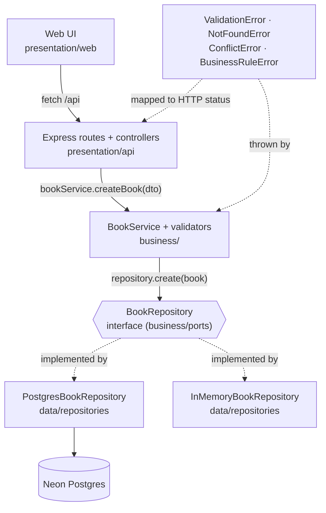

# Shelf - Library Management System

A beautiful, fully-featured Library Management System built with a strict 3-tier architecture (Presentation, Business, Data).


*(Drop a real screenshot here)*

## Quick Start

```bash
npm install
cp .env.example .env        # then paste your Neon DATABASE_URL
npm run db:migrate
npm run db:seed
npm start                   # → http://localhost:3000
```

**Other commands:**
- `npm run start:memory` - Run the app purely in-memory (no database required, Windows users use `npm run start:memory:win`).
- `npm test` - Run the Jest test suite (zero database interaction).
- `npm run swap-test` - Run the end-to-end data layer swap proof.
- `npm run check-layers` - Run the static analyzer ensuring no architectural layer boundaries are broken.
- `npm run verify` - Run the layer check and test suite together.

## Architecture



```text
┌──────────────────────────────────────────────────────────────────────┐
│                       PRESENTATION TIER  /presentation               │
│   Browser SPA (HTML/CSS/JS)  ·  Express routes  ·  Controllers       │
│   Responsibility: input/output, HTTP↔JSON, rendering                 │
│   Forbidden: business rules, SQL, any import from /data              │
└───────────────────────────┬──────────────────────────────────────────┘
                            │ method calls with plain objects
                            │ (errors bubble up as typed domain errors)
                            ▼
┌──────────────────────────────────────────────────────────────────────┐
│                        BUSINESS TIER  /business                      │
│   BookService  ·  bookValidator  ·  domain errors                    │
│   Responsibility: validation, business rules, orchestration          │
│   Depends on: BookRepository (interface) — never a concrete class    │
│   Forbidden: pg, express, HTTP, DOM, SQL                             │
└───────────────────────────┬──────────────────────────────────────────┘
                            │ BookRepository interface (the seam)
                            ▼
┌──────────────────────────────────────────────────────────────────────┐
│                          DATA TIER  /data                            │
│   PostgresBookRepository        │        InMemoryBookRepository      │
│   (pg Pool → Neon Postgres)     │        (Map, no I/O)               │
│   Responsibility: read/write only. No validation. No formatting.     │
└──────────────────────────────────────────────────────────────────────┘
```

### 1. Browser ──HTTP──▶ Express route ──▶ controller ──▶ BookService ──▶ BookRepository (interface)
### 2. PostgresBookRepository → Neon Postgres
### 3. Browser ◀──JSON── error middleware ◀── controller ◀── service ◀── Book entity (plain object)

## What Each Tier Does

### Presentation Tier (`/presentation`)
**Responsibility:** Handling inputs from the user/network and mapping them to business operations. Translating business results and typed domain errors back into HTTP JSON envelopes and DOM updates.
**Forbidden from:** Making database calls, writing SQL, enforcing business rules (like checking quantity before checkout).
**Files:** `api/routes.js`, `api/bookController.js`, `api/errorMiddleware.js`, `web/js/main.js`.

### Business Tier (`/business`)
**Responsibility:** The core of the application. Validates inputs, enforces all business constraints, orchestrates operations, and defines the data contracts (ports) it needs.
**Forbidden from:** Knowing anything about HTTP (status codes, req/res objects), knowing anything about SQL or databases (`pg` driver), rendering UI.
**Files:** `services/BookService.js`, `validation/bookValidator.js`, `ports/BookRepository.js`, `errors/index.js`.

### Data Tier (`/data`)
**Responsibility:** Storing and retrieving data. Maps database rows (snake_case) to domain entities (camelCase) and provides concrete adapters for the business tier's `BookRepository` interface.
**Forbidden from:** Validating data formats (e.g., ISBN length), making business decisions, or depending on anything from the business tier except the base interface class.
**Files:** `repositories/PostgresBookRepository.js`, `repositories/InMemoryBookRepository.js`, `postgres/bookMapper.js`.

## Why Each Tier Only Talks To Its Neighbor

This strict layer boundary ensures **replaceability** (we can swap Postgres for an in-memory Map instantly), **testability** (the business tier is tested without touching a real database), and **separation of concerns** (UI rendering issues do not bleed into SQL syntax). It prevents business rules from being scattered and duplicated across UI constraints and SQL triggers, giving the application a single source of truth.

## Business Rules

All business rules are decided and enforced in the **Business Tier** before the Data Tier is ever called. The constraints defined in `schema.sql` (`NOT NULL`, `UNIQUE`) are storage integrity defenses, not business logic enforcers.

| Rule | Enforcement Location |
|---|---|
| Title/Author cannot be empty | `business/validation/bookValidator.js` |
| Year must be valid (not future) | `business/validation/bookValidator.js` |
| ISBN must be 10 or 13 digits | `business/validation/bookValidator.js` |
| Quantity cannot be negative | `business/validation/bookValidator.js` |
| No checkout at quantity 0 | `business/services/BookService.js` (checkoutBook) |
| Prevent duplicate ISBNs | `business/services/BookService.js` (createBook) |

## Design Decision

*The business tier defines `BookRepository` as an abstraction and receives an implementation via constructor injection, so `BookService` has no idea whether it is talking to Neon Postgres or a JavaScript `Map`. This let the entire test suite run against a fake with no database, and it made the swap test a two-line change in a script rather than an edit to business code.* 

Additionally, checkout is implemented as a read-then-write sequence (`getBookById` -> check quantity -> `update`) rather than a single atomic SQL command (`UPDATE ... SET quantity = quantity - 1 WHERE quantity > 0`). While the atomic version is more robust under concurrency, it pushes the business rule (quantity > 0) into SQL (the data tier), which violates the architectural constraint of the assignment. Correct layering was deliberately chosen over concurrency hardening.

## API Reference

| Method | Path | Body / Query | Success | Errors |
|---|---|---|---|---|
| GET | `/api/health` | — | 200 `{data:{status:'ok', uptime, dataSource}}` | — |
| GET | `/api/meta` | — | 200 `{data:{dataSource, version}}` | — |
| GET | `/api/books` | `?search=&sortBy=&order=` | 200 `{data:[…], meta:{count}}` | 503 |
| GET | `/api/books/stats` | — | 200 `{data:{totalTitles,totalCopies,outOfStock}}` | 503 |
| GET | `/api/books/:id` | — | 200 `{data:{…}}` | 400, 404 |
| POST | `/api/books` | full book | 201 `{data:{…}}` + `Location` | 400, 409 |
| PUT | `/api/books/:id` | all 5 fields required | 200 `{data:{…}}` | 400, 404, 409 |
| PATCH | `/api/books/:id` | any subset of fields | 200 `{data:{…}}` | 400, 404, 409 |
| DELETE | `/api/books/:id` | — | 200 `{data:{id}}` | 400, 404 |
| POST | `/api/books/:id/checkout` | — | 200 `{data:{…}}` | 400, 404, **422** |

Example Checkout Error (422):
```bash
curl -X POST http://localhost:3000/api/books/1/checkout
```
```json
{
  "error": {
    "code": "BUSINESS_RULE_VIOLATION",
    "message": "\"Dune\" is not available for checkout — 0 copies remaining."
  }
}
```

## Swap Test

The swap test (`npm run swap-test`) proves that the business logic works identically against both the Postgres database and the In-Memory store, without modifying a single line of business code. 

**Swap Test Output:**
```
--- SWAP TEST ---
Running In-Memory scenario...
Running Postgres scenario...
Cleaning up Postgres test data...

STEP                 | IN-MEMORY | POSTGRES | MATCH
--------------------------------------------------
1. Create 3 books    | MATCH
2. getAllBooks(ti... | MATCH
3. searchBooks("m... | MATCH
4. getBookById(first)| MATCH
5. updateBook(qty=1) | MATCH
6. checkoutBook(id)  | MATCH
7. checkoutBook a... | MATCH
8. invalid ISBN      | MATCH
9. duplicate ISBN    | MATCH
10. getStats()       | MATCH
11. deleteBook       | MATCH
12. getBookById de...| MATCH

SWAP TEST PASSED — 12/12 steps identical
```

## Testing

**No test touches a real database; all business tests run against `tests/fakes/FakeBookRepository.js`.**

The tests cover all logic branches for creating, updating, searching, deleting, and checking out books. The presentation API tests run against the Express app initialized with the in-memory repository to guarantee that network handlers execute correctly without spinning up Postgres.

## Project Structure
```
library-manager/
├── app.js                          # composition root
├── server.js                       # entry point
├── config/                         # environment configs
├── presentation/                   # API routes and Web UI
├── business/                       # services, validation, errors
├── data/                           # db/memory repos, sql, seeds
├── tests/                          # fake repos and jest tests
├── scripts/                        # db ops and checker scripts
└── docs/                           # architecture diagrams
```

## Deduction Self-Check

| Deduction Risk | Avoided How? |
|---|---|
| UI calling DB directly | UI `fetch()`es `/api/books` handled by `bookController`, handled by `BookService`, handled by repo. |
| Rules in UI or DB | Business constraints (like checking quantity before checkout) enforced only in `BookService.js`. |
| Tests hit DB | All tests utilize `FakeBookRepository` or `InMemoryBookRepository`. No pg dependency in tests. |
