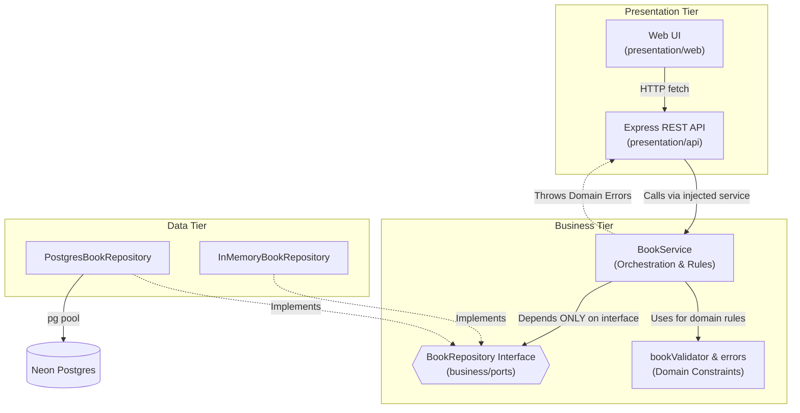

# Architecture of Shelf (Library Management System)

This project strictly adheres to a three-tier layered architecture separating Presentation, Business Logic, and Data Access concerns.

## Dependency Flow

## Overview of Layers

### Presentation Layer (`presentation/`)
The outer shell handling the user interface and the web protocol (HTTP). It contains static HTML/CSS/JS files and the Express REST API that serves them and responds to client requests. It validates only incoming structures (e.g. is it valid JSON) before passing DTOs to the Business Layer. **It contains no business rules and never calls the database directly.**

### Business Layer (`business/`)
The brain of the operation. Contains `BookService` and `bookValidator` which enforce all the core rules: title rules, year limits, ISBN formats, and quantity validations (you can't checkout a book with zero copies).
**It does not depend on Postgres or Express.** Instead, it relies on an abstract interface `BookRepository`. This layer only receives plain objects and throws strict domain errors.

### Data Layer (`data/`)
Handles interactions with persistence, providing implementations for the `BookRepository` interface. It translates domain objects into database rows and vice versa, executing parameterized SQL. **It performs no validation and does not know how the data will be displayed.**

By perfectly separating the architecture this way (with all dependencies pointing inward towards the Business Layer), the Data Layer is completely independent and can be swapped for an in-memory equivalent instantly without impacting application logic.
