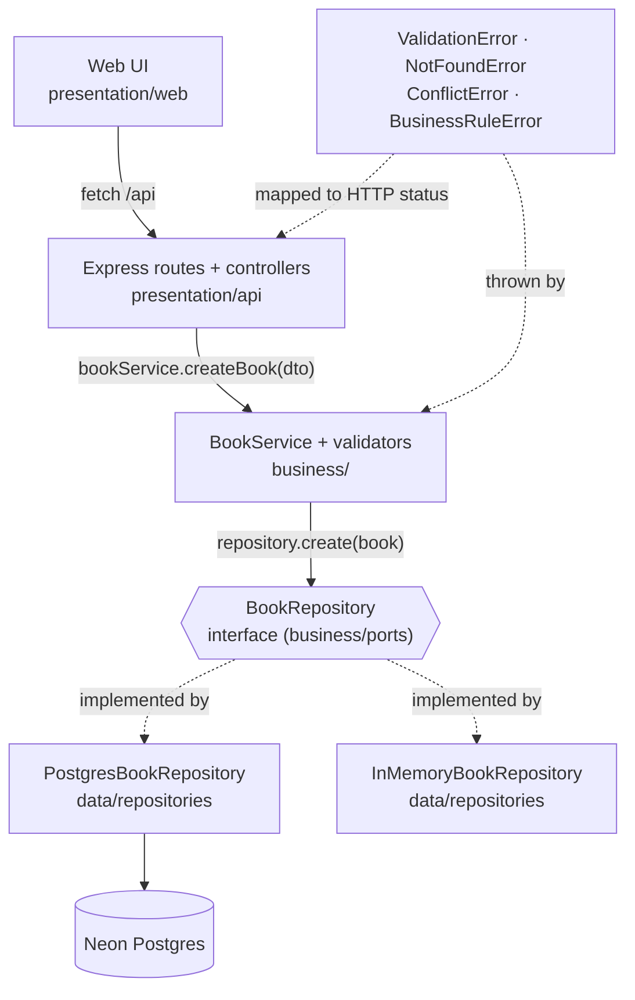

# Architecture of Shelf (Library Management System)

This project strictly adheres to a three-tier layered architecture separating Presentation, Business Logic, and Data Access concerns.

## Dependency Flow

## Overview of Layers

### Presentation Layer
The outer shell handling the user interface and the web protocol (HTTP). It contains static HTML/CSS/JS files and the Express REST API that serves them and responds to client requests. It validates only incoming structures (e.g. is it valid JSON) before passing DTOs (Data Transfer Objects) to the Business Layer.

### Business Layer
The brain of the operation. Contains `BookService` and `bookValidator` which enforce all the core rules: title rules, year limits, ISBN formats, and quantity validations (you can't checkout a book with zero copies).
It does not depend on Postgres or Express. Instead, it relies on an abstract interface `BookRepository`.

### Data Layer
Handles interactions with persistence, providing implementations for the `BookRepository` interface. It translates domain objects into database rows and vice versa, executing parameterized SQL. 

By separating the architecture this way, the Data Layer is completely independent and can be swapped for an in-memory equivalent instantly without impacting application logic.
